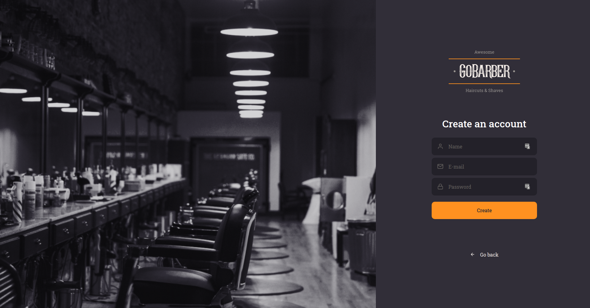
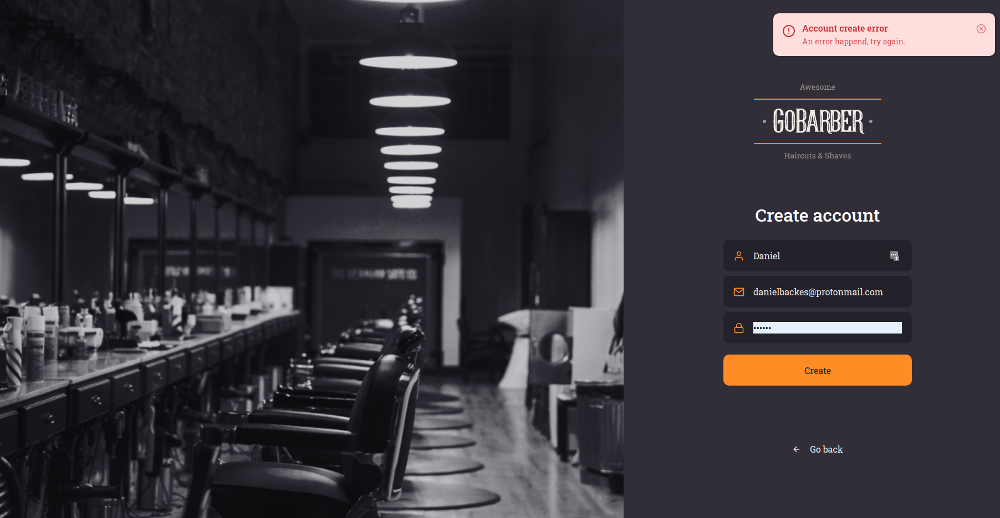

# GoBarber Web

Project developed copying the instructor coding during the Rocketseat Bootcamp Course.

This is the GoBarber's Web Page to manage barbershop scheduling.

## What I learned in this project?

  - Utilize useRef and useCallback react hooks.
  - I learned that react has attributes set of each html component, and using this it's possible create component that receive any native attribute.
  - Use Unform component to manage form data.
  - How Styled Components allow stylize a children component.
  - Create a React Context to share data with many components.
  - I learned that the function returned by an useEffect component will be executed as soon as the component died.
  - Another cool and useful thing that I learned was that when a set<State> method, created by useState component, receive a function instead an object, this function will receive the <State> object as parameters.
  - How animate died components with react-spring and how animate using css keyframes.

## What I did in this project?

  - Create button and input components to utilize in many pages.
  - Set input style when the field is focused or filled.
  - Create form validation with Yup component.
  - Create a tooltip component to show aside the field his validation errors.
  - Develop AuthContext to save the authenticated user.
  - Use AuthContext to share Auth data and functions and use localStorage to store the token and user that is authenticated.
  - Create a toast message component.
  - Create a Toast Hook, using Context, to add and remove toasts.
  - Animate toast with react-spring component and create routes to SignIn and SignUp pages.
  - Create private routes that require authentication to be accessed and integrated account create page with the API.

## See the screenshots

